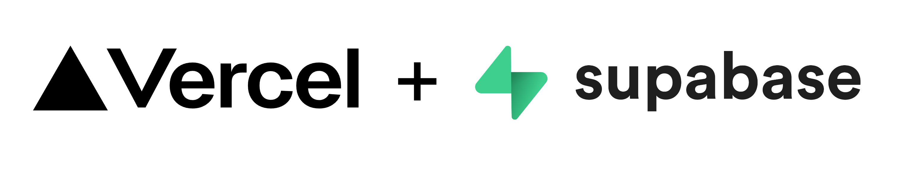

# Public Beta Release

We are excited to announce the public beta for X-ray Atlas. This is a major
milestone for the project and we are excited to share it with the community in
a state that is ready for public use.

A year ago, X-ray Atlas was a mostly static website with a few interactive
plots and a few datasets. There was no way to upload or contribute data to the
platform. Since then we have been working hard to build out the platform as an
interactive, collaborative platform for NEXAFS data.

## Moving out of AWS

Previously, the platform was fully hosted by native AWS services, and the data
was stored in JSON files within S3 buckets. Data upload was performed
primarily through a manual process using the AWS web console.

This was not the behaviour we wanted for the platform. We want to democratize
data sharing and make it as easy as possible to contribute data to the
platform. To facilitate this we made the decision to move to a platform with
proper backend relational database support, better user authentication, and a
more flexible data model.

We decided to move to Supabase, a database-as-a-service provider with a
gracious support team and a free tier that is more than enough for the
platform at this stage of development. For deployment and hosting, we are
using Vercel, an industry leading platform for web development.

With this new infrastructure in place, we are able to safely and securely host
X-ray Atlas as a fully functional platform with all the user interactions and
bells and whistles the community deserves.

## What's in the beta

There is too much to cover in one post, so we are breaking it up. Each of the
following posts covers one piece of the platform in depth.

[**Users, sign-in, and attribution**](/blog/beta-users). ORCID-based sign-in,
and how attribution and provenance work, including claiming and unclaiming
your contributions.

[**The molecule registry**](/blog/beta-molecules). How molecules are
registered, searched, and drawn, and why polymers and monomers share a record.

[**Facilities and instruments**](/blog/beta-facilities). Linking beamlines to
the platform, claiming instruments, and where dashboard connectors are headed.

[**Uploading NEXAFS data**](/blog/beta-uploading-data). The principles behind
the upload flow, the CSV format, auxiliary files, and in-app processing.

[**Kramers-Kronig in the browser**](/blog/beta-kramers-kronig). Computing
$\delta$ from $\beta$ natively in the app, and how we validated it against
kkcalc2.

If you want to skip the reading, [sign in](/sign-in) with your ORCID account
and [start contributing](/contribute). If something fights you, that is a bug
we want to hear about.
