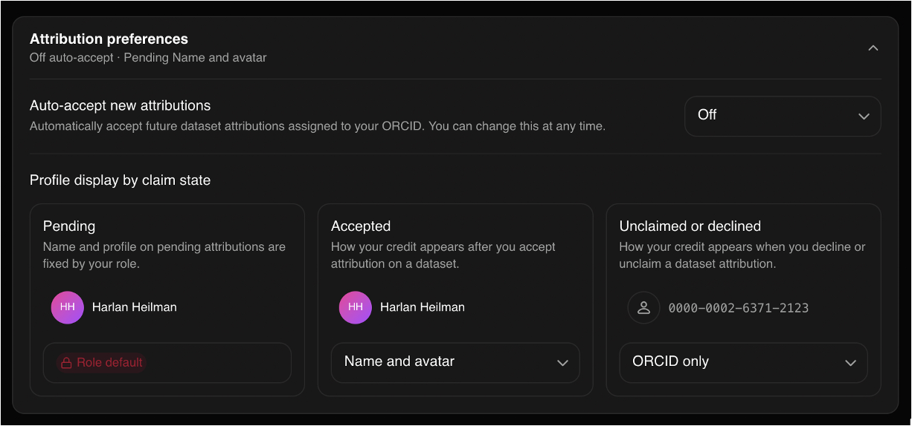

# Users, sign-in, and attribution

This post is part of the [public beta release series](/blog/beta-release).

Academic researchers and students are the intended users for this platform. We
had one philosophy when designing the platform, it should be as easy as
possible to engage with. So rather than building a bespoke authentication
system, we decided to use industry standard social sign-on through ORCID as
the primary authentication provider. [ORCID](https://orcid.org) is a global
identifier for researchers (think a DOI for researchers) and is used by many
institutions including university libraries and government labs for research
identity management. By integrating with ORCID, we are able to leverage their
existing infrastructure and identity verification systems that most
researchers have already bought into, without having to deal with the
complexity and security concerns of building our own authentication system.

Users can [sign in now](/sign-in) with their ORCID accounts, allowing them to
contribute data in the form of NEXAFS spectra, or assist the rest of the
platform by registering new molecules into the X-ray Atlas
[molecule registry](/blog/beta-molecules) or linking their favorite
[beamlines](/blog/beta-facilities) to the platform.

## Attribution and provenance

Core to the design of the platform is the requirement that all data is
attributed to the people who worked together to collect, reduce, analyze,
curate, and share the data. We have built a system that allows users to
provide attribution information for their collaborators on the dataset records
they create.

Now, this naturally leads to the question "What if I helped take some data,
but it is really poor quality and I don't want to be associated with it?" or
"I contributed to this dataset decades ago and I don't want my name attached
to it anymore?". These are valid concerns even for the best research
environments. So we decided to build this into the system by allowing users to
claim or unclaim their contributions to a given dataset. Your ORCID iD will
still be associated with the dataset, but we will not link it to your profile,
won't show your name, and users will have to navigate out to your ORCID
profile before they can find your name. You can set the default behaviour for
your account in your [profile settings](/account/attributions/pending).

Attribution records follow DataCite conventions for contributor roles, so
datasets hosted here can be cited the way literature is. This is groundwork
for more on the persistent-identifier front, and we will write about that when
it is concrete.

Next in the series, [the molecule registry](/blog/beta-molecules).
