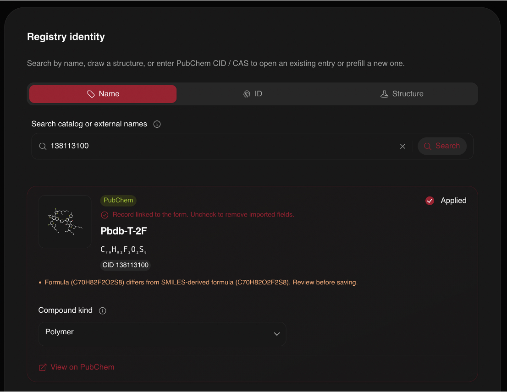
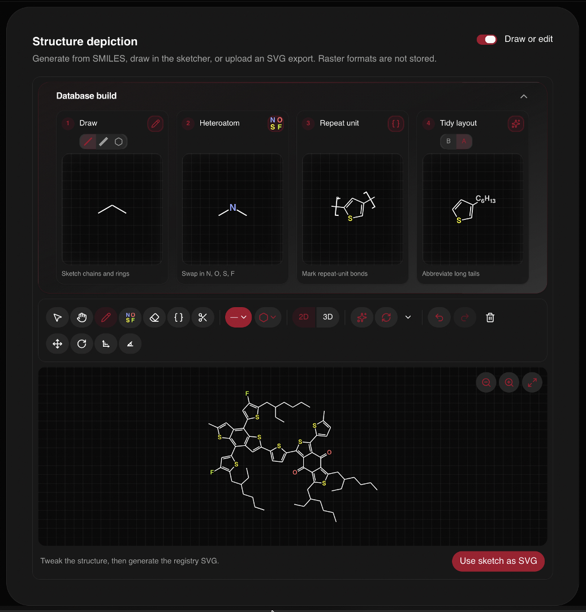

# The molecule registry

This post is part of the [public beta release series](/blog/beta-release).

Molecules are the building blocks of the platform. We are perfectly fine with
attributing datasets to non-molecular systems, polymers, and the like, but we
call these entities "molecules" because I am not a chemist and it is a good
enough name. For our purposes, a molecule is a set of atoms that are bonded
together in a specific way, with a specific structure. We also group all
common structures into a single molecule record, so P3HT
(poly(3-hexylthiophene)) the polymer and 3HT (3-hexylthiophene) the monomer
live in the same molecule record, and the distinctions live in the experiment
record.

## Registering a molecule

Register a molecule by searching public APIs like PubChem or CAS using common
names, chemical formulas, or other identifiers, by specifying an external
identifier directly, or by using the molecule sketcher to search with a
structure.

Once this is done, you can fine tune the molecule record with more
information, including synonyms, tags, and other metadata. Importantly, choose
a common name that you use to identify the molecule that will appear in the
platform (this can be changed later to any synonym you like). You can then
either upload an SVG of the molecular structure, draw it yourself in the
browser, or use registry stub mode to create a placeholder.

Behind the form, the registry runs chemistry-aware validation. SMILES input is
checked, including polymer notation, structure depictions are generated
through a shared pipeline so they render consistently across the catalog, and
identity checks catch duplicates before they land. The goal is that two people
uploading data on the same material end up on the same record, with their
datasets side by side, rather than on two records that differ by a synonym.

Once the molecule is registered, you can upload spectroscopy data against it;
see [uploading NEXAFS data](/blog/beta-uploading-data).

Next in the series, [facilities and instruments](/blog/beta-facilities).
