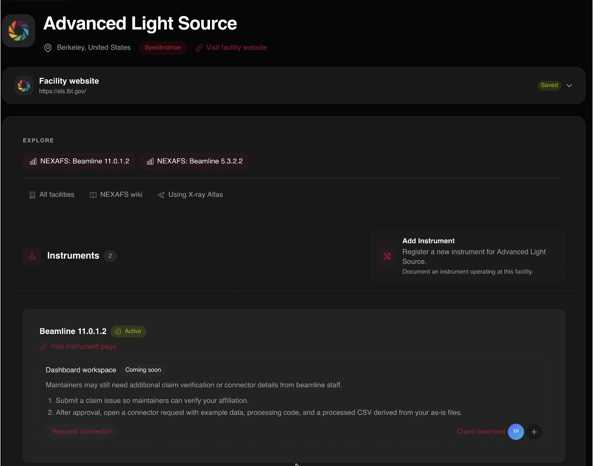
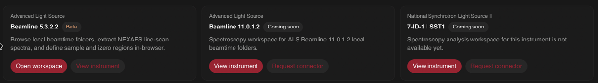

# Facilities and instruments

This post is part of the [public beta release series](/blog/beta-release).

User facilities are the backbone of this research and infrastructure. Linking
a facility to the platform lets users know which beamlines collected which
data, and cross-compare datasets on the same sample between different
facilities and instruments.

Currently facilities live in a minimal state, providing just enough
information to really be useful. This can and will be expanded upon in the
future.

If you are a beamline scientist, or just an interested user, feel free to add
your facility to the platform using the facility registration form. Once
registered, you can add instruments to the facility.

## Claiming an instrument

Once an instrument has been added, beamline scientists can seek to claim it,
deepening the collaboration between the beamline and the platform. Once
claimed, we can work together to build a dashboard connector to the
instrument, allowing users to directly view and process their data from inside
X-ray Atlas, or directly view X-ray Atlas data from within the instrument
control software.

This is not hypothetical. A beta of the first connector exists today for STXM,
with a folder browser over facility data, region-based reduction in the
browser, and direct linking of reduced traces to experiment records. It is a
work in progress and we are saying so plainly. If you collect STXM data and
want to try it, get in touch.

Next in the series, [uploading NEXAFS data](/blog/beta-uploading-data).
