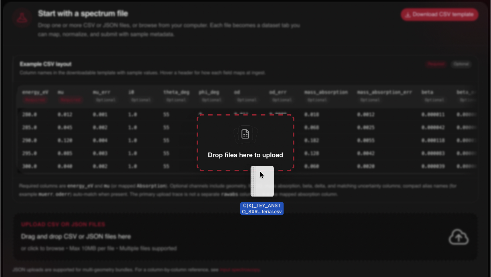
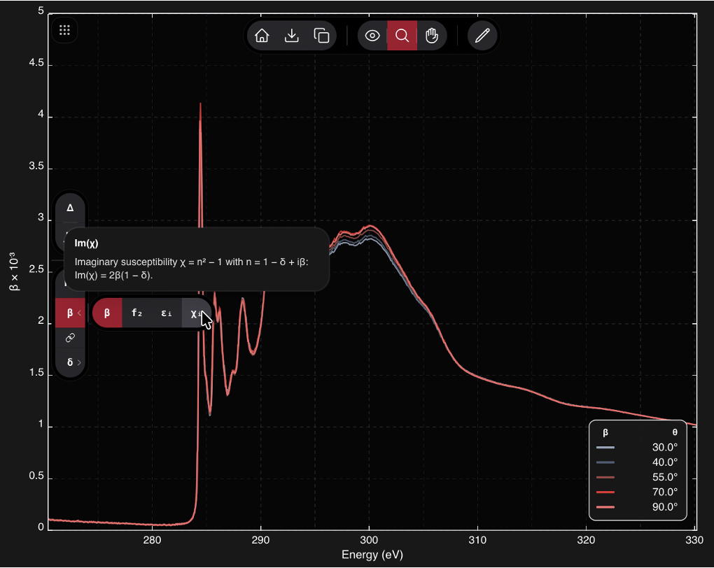
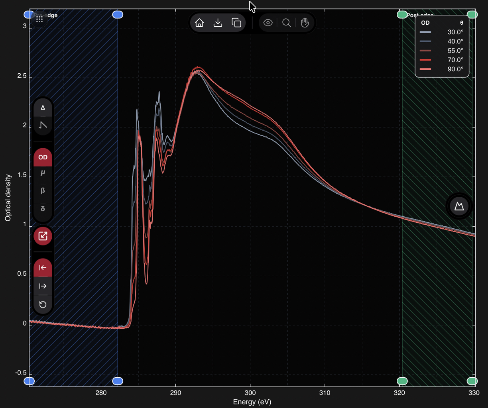
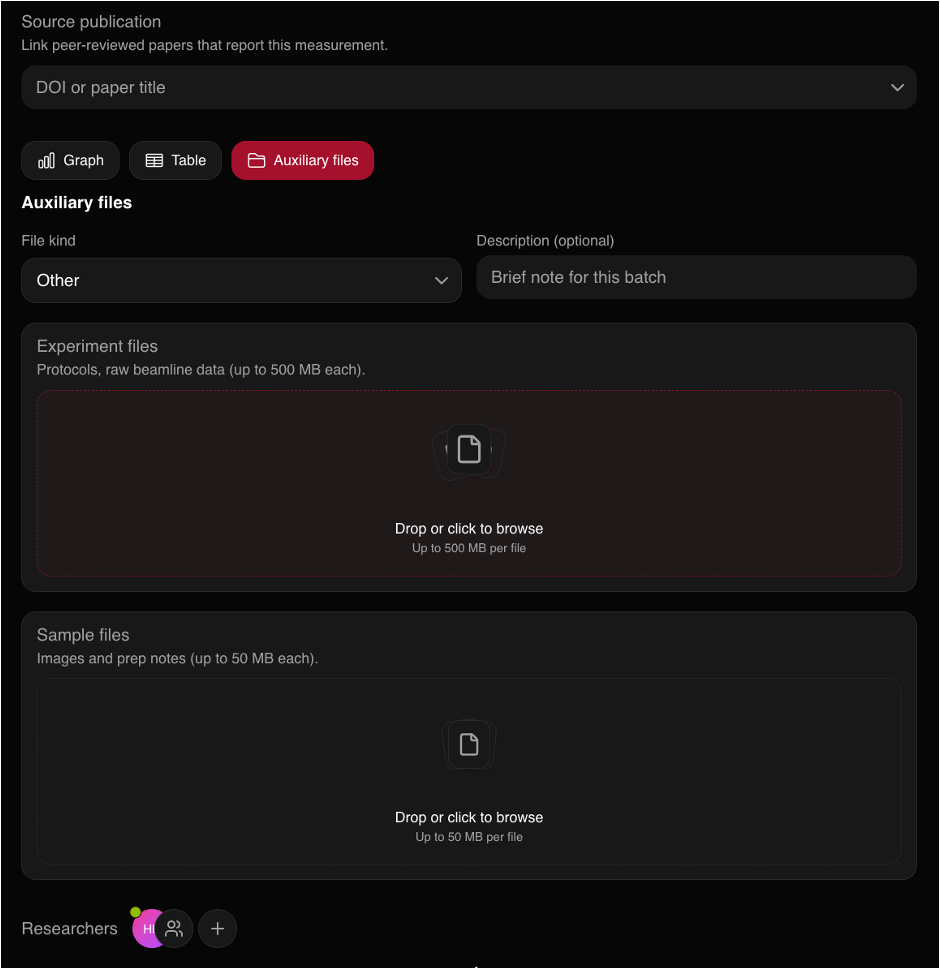
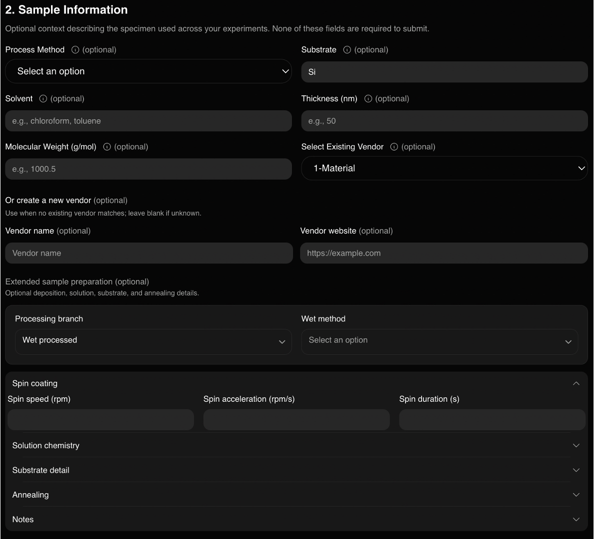

# Uploading NEXAFS data

This post is part of the [public beta release series](/blog/beta-release).

Data uploading is now done through a guided flow and a validated form. There
are three main entities that can be uploaded to the platform, molecules,
facilities, and spectroscopy data. The first two have
[their](/blog/beta-molecules) [own](/blog/beta-facilities) posts. This one is
about the one you were waiting for, and walks through the whole flow start to
finish.

NEXAFS data is tricky in general to deal with. There is a zoo of similar names
that all mean something slightly different. So we had to build a system that
could handle this in a uniform way.

## Driving principles

To start, there are a couple of key driving principles for this process.

1. Non-normalized NEXAFS data is borderline useless to store in a database. If
   all you want is a qualitative comparison between two datasets, you can just
   compare the figures from a publication. We want to be able to
   quantitatively compare datasets between each other.
2. If you come to X-ray Atlas wanting any version of an optical constant
   ($f$, $n$, $\epsilon$, $\chi$, or SLD), you should be able to get it for
   free. People use different conventions and units. We want to support them.
3. We should preserve the original data as it was uploaded to the platform,
   but allow users to tweak their data to ensure it is in a quality they are
   comfortable with sharing. This means that common data "tweaks" need to be
   first class citizens in this platform, including pre- and post-edge
   ranges, peak assignments, and more.
4. We want it to be as easy as possible to upload data from 10 years ago that
   you have sitting on a USB drive. So we need a format that people are
   comfortable with. So we are going to force you to use CSV files to upload
   your data.
5. We know that every experiment and sample is unique, making it hard to
   conform to a single format that can accommodate all of the metadata needed
   to describe it. So we allow you to upload auxiliary files to accompany the
   CSV representation of your data.
6. We are going to have to be opinionated and make some decisions about
   conventions used and processes on the platform. If we don't accept this
   fact, then the platform will never be made, never be used, and never scale
   to the community we want it to serve. We will make mistakes in the process
   of learning what we can ignore and what we must enforce.

Now, back from the philosophy. Here is what actually happens when you upload
a dataset, step by step.

## 1. Start with a spectrum file

Every upload starts with a CSV (JSON is also supported, for multi-geometry
bundles). Download the template from the upload page and use it as a guide,
`energy_eV` and an absorption column are the only two required fields;
everything else, geometry, uncertainties, optical density, is optional and
auto-matched by common aliases (`muerr`, `oderr`, and the like) when present.

Drag your file onto the drop zone, or browse from your computer. Each file
becomes its own dataset tab, so you can queue up several spectra and work
through them in one sitting (`Cmd+N` for a new tab, `Cmd+1` through `Cmd+9` to
jump between them).

One tip worth knowing: if your filename follows the convention
`EDGE_MODE_FACILITY_BEAMLINE_EXPERIMENTER.csv` (for example
`CK_TEY_ALS_BL6.3.1_smith.csv`), the app pre-reads the edge and detection mode
from the name and offers to fill them in for you. It is not required, but it
saves a few clicks if your instrument software already names files this way.

## 2. Map your columns, if needed

If your header names do not match the flexible matcher, a column-mapping
step opens so you can tell the app which column is energy, which is
absorption, and which (if any) are theta and phi. Energies must increase
strictly monotonically within a trace; angle-resolved uploads split into
separate geometry traces automatically once theta and phi columns are
present and vary.

## 3. Describe the dataset

Each dataset tab has four required descriptors: molecule, instrument, edge,
and detection mode (TEY, PEY, fluorescence yield, or transmission). Click any
of them to search the existing registry, or open the inline "add new" form if
your molecule or facility is not yet in the catalog, which is the same
registration flow covered in the [molecule](/blog/beta-molecules) and
[facilities](/blog/beta-facilities) posts. A small badge on the tab tracks how
many required fields are still missing, so you always know what is left
before you can submit.

## 4. Inspect the parsed spectrum

Before anything is committed, the portal plots exactly what it parsed from
your file, table view or graph view, so there is no gap between what you
uploaded and what the database will store. From here you can already switch
between the raw absorption, optical density, and (once a molecule is set)
the derived channels used in scattering analysis.

## 5. Normalize against the bare atom

This is the step we most want people to not skip. Set pre-edge and post-edge
energy windows, either by clicking directly on the plot or by typing energy
values, and the app computes a bare-atom absorption reference from your
molecule's chemical formula for comparison. If you don't set these regions,
the platform picks sensible defaults for you (the first and last several
points of the trace) so nothing blocks on this step, but a deliberate choice
is almost always better than the default.

These windows are not just cosmetic. They feed the platform's dataset
quality signals, how well your measured absorption agrees with the bare-atom
curve in the tails, and they are what let the app estimate uncertainties on
the absorption and on any derived optical constants when your file did not
already include error columns.

## 6. Optional: compute delta in the browser

If your molecule's formula is set, you can opt in to computing the
dispersive optical constant $\delta$ from your measured $\beta$ via the
Kramers-Kronig transform, right there in the browser, no export and
re-import required. It asks for one-time consent per browser session since
the calculation can be CPU-heavy on dense spectra. This is worth its own
post: see [Kramers-Kronig in the browser](/blog/beta-kramers-kronig) for how
it works and how we validated it.

## 7. Mark peaks (beta)

You can also assign peaks to the spectrum. This feature is genuinely still
beta, both the interaction and the underlying schema are subject to change,
so treat anything you mark today as provisional.

## 8. Attach auxiliary files

Reduction scripts, instrument logs, protocols, raw instrument files, images,
spreadsheets, whatever context does not fit in a spectrum CSV, upload
alongside the dataset as auxiliary files. They can be attached at the
experiment level or the sample level, are stored in object buckets, and
inherit the same access permissions as the dataset itself, private while the
submission is pending, and public once approved if you chose to make the
dataset public. This is also where you attach a source publication by DOI,
which resolves a citation preview automatically, and where researcher and
team attribution for the dataset lives; see the
[users and attribution post](/blog/beta-users) for how claiming and
unclaiming credit works.

## 9. Describe the sample

Once you're happy with the data, fill in the sample information form,
preparation method, substrate, thickness, whatever is relevant to your
measurement. We can auto-generate a metadata dump from what you've already
entered, but we genuinely encourage filling out the structured form instead,
because structured fields are indexed and searchable across the catalog and
free-form auxiliary files are not. Not yet, anyway.

## 10. Submit

Once every dataset tab shows complete, submit the whole batch at once.
Datasets remain private and are reviewed before anything goes live; nothing
you submit is publicly visible until an administrator approves it. You can
come back and adjust normalization windows, peak assignments, or attribution
on a dataset after submission, none of this is a one-shot, irreversible
action.

That is the whole path from a CSV on your USB drive to a searchable,
attributed, quality-scored record in the catalog. A direct Python API is
coming soon to script the parts of this that are naturally scriptable, bulk
uploads especially. For the column-by-column reference, see
[uploading data](/wiki/atlas/uploading-data) in the wiki.
