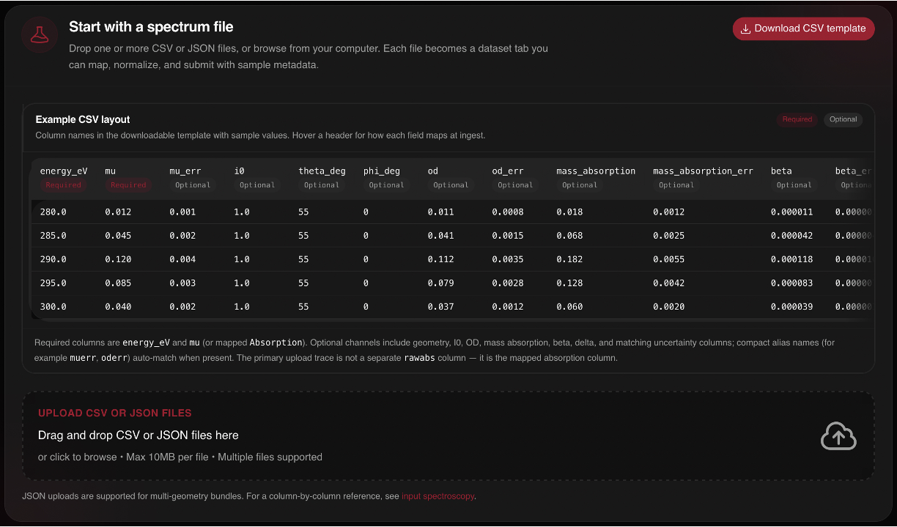

# Uploading NEXAFS data

This post is part of the [public beta release series](/blog/beta-release).

Data uploading is now done through a guided flow and validated form. There are
three main entities that can be uploaded to the platform, molecules,
facilities, and spectroscopy data. The first two have
[their](/blog/beta-molecules) [own](/blog/beta-facilities) posts. This one is
about the one you were waiting for.

NEXAFS data is tricky in general to deal with. There is a zoo of similar names
that all mean something slightly different. So we had to build a system that
could handle this in a uniform way.

## Driving principles

To start, there are a couple of key driving principles for this process.

1. Non-normalized NEXAFS data is borderline useless to store in a database. If
   all you want is a qualitative comparison between two datasets, you can just
   compare the figures from a publication. We want to be able to
   quantitatively compare datasets between each other.
2. If you come to X-ray Atlas wanting any version of an optical constant
   ($f$, $n$, $\epsilon$, $\chi$), you should be able to get it for free.
   People use different conventions and units. We want to support them.
3. We should preserve the original data as it was uploaded to the platform,
   but allow users to tweak their data to ensure it is in a quality they are
   comfortable with sharing. This means that common data "tweaks" need to be
   first class citizens in this platform, including pre- and post-edge ranges.
4. We want it to be as easy as possible to upload data from 10 years ago that
   you have sitting on a USB drive. So we need a format that people are
   comfortable forcing their data into. So we are going to force you to use
   CSV files to upload your data.
5. We know that every experiment and sample is unique, making it hard to
   conform to a single format that can accommodate all of the metadata needed
   to describe it. So we allow you to upload auxiliary files to accompany the
   CSV representation of your data.
6. We are going to have to be opinionated and make some decisions about
   conventions used and processes on the platform. If we don't accept this
   fact, then the platform will never be made, never be used, and never scale
   to the community we want it to serve. We will make mistakes in the process
   of learning what we can ignore and what we must enforce.

## The upload flow

Now, back from the philosophy, let's talk about how you upload data to the
platform.

Download the template CSV file and use it as a guide to force your data to
match the expected spectrum format. Then drag and drop your file to upload it
to the platform. The mapper matches your column headers flexibly, energies
must increase strictly monotonically, and angle-resolved series split into
separate traces per geometry when theta and phi columns vary. A direct Python
API is coming soon to make this process even easier.

Auxiliary files, reduction scripts, beamline logs, calibration data, upload
alongside the CSV and are stored in object buckets with access gated by the
same permissions as the dataset itself.

## In-app data processing and tweaking

What you upload is shown back to you before anything is committed. The portal
plots your parsed traces so there is no gap between what you see and what the
database stores. Pre-edge and post-edge ranges are captured as part of the
upload contract per principle three, which is what lets the platform's
quality metrics assess normalization rather than guess at it, and lets you
adjust the windows on data you have already uploaded.

If you opt in at upload, the platform will also compute the dispersive optical
constant $\delta$ from your absorptive $\beta$ via the Kramers-Kronig
transform, directly in your browser, and persist it with the dataset. That
calculation, and how we validated it, is the subject of
[the final post in this series](/blog/beta-kramers-kronig).
