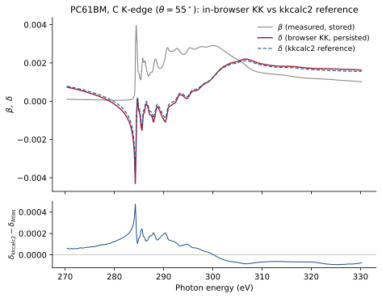

# Kramers-Kronig in the browser

This post closes out the [public beta release series](/blog/beta-release).

The catalog stores $\beta$, the absorptive part of the index of refraction,
because that is what a NEXAFS measurement determines. But scattering work
needs the dispersive part $\delta$, and the two are linked by causality
through the Kramers-Kronig relations,

$$
\delta(E) = \frac{2}{\pi}\,\mathcal{P}\!\!\int_0^{\infty}
\frac{E'\,\beta(E')}{E'^{2}-E^{2}}\,dE'.
$$

Computing this used to be an offline chore, exporting your data, running
desktop tooling, and re-importing the result. Per principle two of
[the upload post](/blog/beta-uploading-data), optical constants should come
for free. So X-ray Atlas runs the transform natively in the browser, following
the piecewise polynomial method of kkcalc [@watts2014], adapted for in-app
execution. Because the dispersion integral runs over all energies, the
measured near-edge window is extended with tabulated atomic scattering factors
computed from the molecule's chemical formula before transforming, and the
result is mapped back onto your measured energy grid with modified Akima
interpolation, which suppresses the overshoot cubic splines produce near sharp
resonances.

The calculation runs at upload time when you opt in, or on demand from a
dataset panel for authorized users. The computed $\delta$ persists on the
spectrum alongside metadata recording the run, so anyone retrieving the
dataset later can see exactly how it was produced. The original uploaded data
is never modified, per principle three.

## Validation

A calculation like this is only useful if you can trust it, so we validated
the in-app implementation against kkcalc2 on the same data. The figure below
overlays the persisted in-browser $\delta$ with the kkcalc2 reference for a
PC61BM carbon K-edge trace from the catalog, with the residual in the lower
panel. The two agree through all of the resonant structure, with residuals of
a few parts in $10^{4}$ concentrated at the sharp $\pi^{*}$ edge where the
extrapolation treatments differ.

The validation suite runs in CI against pinned reference outputs, including
checks of the extended scattering-factor pipeline, the interpolation
alignment, and the Henke tabulation against the live CXRO data, so the
implementation cannot drift quietly.

With $\beta$ and $\delta$ stored, the browse plots derive the rest, $f_1$ and
$f_2$, and the real and imaginary parts of $\varepsilon$ and $\chi$, in the
browser on demand. The definitions and conventions are spelled out in the
[wiki](/wiki/nexafs/quantities).

That is the beta. [Sign in](/sign-in), [browse](/browse/nexafs), upload
something, and tell us what breaks.
