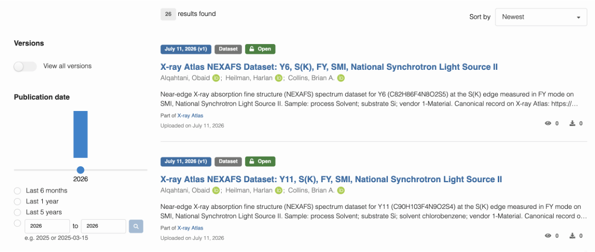
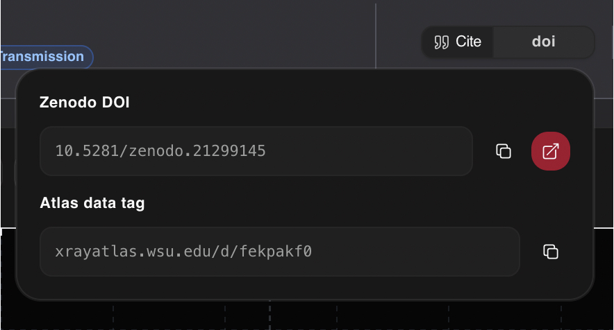
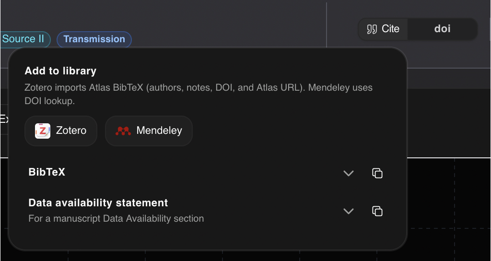

# Individual Dataset Citations

Core to this project is the ability to directly cite an individual dataset,
allowing a researcher to both credit the dataset and link to it directly from
within their work. While we aim to integrate directly with DataCite for
future DOI minting by X-ray Atlas itself, we have instead opted for a stopgap
solution through Zenodo. This lets each dataset have a unique DOI minted by
Zenodo, and gives us a backup store of the dataset.

## The X-ray Atlas Zenodo Community

As part of this, we have created a [Zenodo community for X-ray Atlas
datasets](https://zenodo.org/communities/xrayatlas/). This does double duty
by providing both a persistent DOI and a backup of the data itself in the
event that something happens to X-ray Atlas.



Uploads are managed by an automated X-ray Atlas service account that lets
users mint DOIs directly upon dataset upload. However, Zenodo DOIs are
permanent records and cannot be deleted, so be cautious about what data you
upload.

This integration will remain once we join the DataCite community, where
Zenodo will transition to a full backup system storing data artifacts, while
X-ray Atlas will directly provide identifiers for more complex collections of
data.

## Persistent DOIs and Atlas dataset tags

Along with the DOI integration, we have also added dataset tags within the
X-ray Atlas metadata. This lets users easily link back to an individual
dataset from within their work.



The tag URL uniquely links to the dataset and can be shared with others to
reference it directly. In the future, this tag will be replaced with an
X-ray Atlas DOI system.

## Citations

The exact citation guidelines are in flux and will likely change over time.
For now, we request that users cite a dataset using the BibTeX we provide for
each one.



We also provide a Zotero button that will directly add the dataset to your
Zotero library, along with a Mendeley button that will add it to your
Mendeley library. This option has not been thoroughly tested for parity with
the BibTeX export, so treat the BibTeX as the single source of truth for
citation information.

Along with this, we request that users cite the database itself. For now
this is done without author attribution, but in the future it will require
citation to the X-ray Atlas paper. We also request that users cite any
originating publications for the dataset. Lastly, we ask that users
acknowledge in their data availability statement something along the lines
of

```
NEXAFS datasets for this work are openly available on X-ray Atlas (CC BY 4.0).
```

Additionally, each dataset is expected to be cited separately everywhere it
appears in the user's work. We expect this to become cumbersome for large
datasets, and this is another driver for our partnership with DataCite.

This is generally the start of a robust citation system for NEXAFS data, and
we are still in the early stages of development. A non-exhaustive list of
future plans includes:

- Per dataset licensing agreements
- Per sample citations
- Per instrument citations
- Whole database citations
