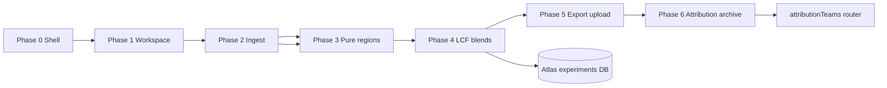

# Dashboard and ALS 5.3.2.2 STXM integration plan

Technical roadmap for opening the X-ray Atlas dashboard to beamline-local STXM line-scan processing, porting numerics from the Python `stxm` package, and connecting outputs to Atlas NEXAFS contribute, attribution teams, and publication workflows.

**Branch:** `feat/dashboard-stxm-5322`  
**Status:** Phase 0–3 on branch; **facility-first STXM folder browser UX** (local File System Access API, no upfront experiment link).

---

## UX flow (2026-06-04 redesign)

1. **Dashboard home** — "Analysis instruments" grid with **ALS Beamline 5.3.2.2 (STXM)** card (no "Start session" CTA).
2. **`/dashboard/instruments/als-5322`** — Select local STXM data root via `showDirectoryPicker` (Chromium); recent folder pills in sessionStorage.
3. **Experiment tab** — Horizontal beamtime cards from subfolders matching `YYYY-MM(Month)` / `YYYY_MM(Month)`; click beamtime → Finder-style grouped scan grid (LINE / IMAGE / FOCUS / OTHER).
4. **Select line scan** — Thumbnail + filename; switches to **Ingestion** tab with heatmap, region bounds, weighting toggles, Recompute spectra.
5. **Export (later)** — Optional Atlas experiment link and aux upload; processing is standalone until export phase.

**Experiment linking:** Not required for ingest/regions/reduce. `linked_experiment_id` remains on session for future export only. Step gating uses `hasSelectedLocalScan`, not experiment link.

**Local storage:**

| Layer | What | Where |
|-------|------|--------|
| Raw STXM | `.hdr` / `.xim` on disk | User folder via File System Access API (browser only) |
| Directory handle | Re-open same root | IndexedDB `xray-atlas-stxm` / `directory-handles` |
| Recent roots | Display names + handle keys | sessionStorage `xray-atlas:stxm-recent-folders:v1` |
| Session metadata | Workspace context, regions, reduce | `dashboard_processing_session.step_metadata` (auto-created on folder pick) |

**File System Access API limitations:** Chromium-only; Safari/Firefox show fallback message. Handles require re-permission after reload or new tab; IndexedDB persistence is best-effort within the same browser profile.

---

## Storage architecture (Phase 2 — Atlas aux path, optional export)

| Layer | What | Where |
|-------|------|--------|
| **Raw STXM (export)** | `.hdr` / `.xim` bytes | Supabase `experiment-aux` bucket when user links experiment at export |
| **Session manifest** | Workspace folder/beamtime/scan, parse summaries | `step_metadata.workspace` + `ingest` JSON |
| **Regions** | Sample/izero bounds, weighting mode | `step_metadata.regions` JSON |
| **Reduction outputs** | OD spectra + diagnostics per region | `step_metadata.reduce` JSON |
| **Future promote** | Canonical `spectrumpoints` on Atlas experiment | Phase 5 export/upload workflow |

Raw files are authoritative; session JSON holds browser-computed artifacts and provenance until Fit/Export promotes spectra into NEXAFS contribute paths.

---

## Locked decisions (2026-06-04)

| Topic | Decision |
|-------|----------|
| **Permissions** | **Auth-only.** Any signed-in Atlas user may access `/dashboard`, create sessions, and run browser-side processing. Do **not** gate with `labs_access`. |
| **Raw STXM storage** | Reuse **`experiment-aux`** bucket and **`experiment_file`** aux upload patterns (`~/server/aux-file-contract.ts`, `experimentFile` router). Phase 1 stores parse summaries on the session only; raw upload when an experiment is linked (Phase 2). |
| **Numerics** | **Browser-side TypeScript** for `.hdr`/`.xim` parsing and STXM processing. No server worker for numerics in Phase 1. |

---

## Context

### xray-atlas today

| Area | Location | Notes |
|------|----------|-------|
| Dashboard nav (was disabled) | `src/components/ui/avatar.tsx` | Account menu item; wired in Phase 0 |
| Dashboard routes | `src/app/dashboard/` | Phase 0 shell only |
| Account / auth gate pattern | `src/app/account/layout.tsx`, `src/app/sandbox/layout.tsx`, `src/app/admin/layout.tsx` | Sign-in required; sandbox/admin add capability checks |
| Attribution teams | `src/app/account/teams/`, `src/server/api/routers/attributionTeams.ts`, `src/features/account/teams/` | Beamtime/working rosters; apply-team on contribute |
| NEXAFS contribute | `src/features/process-nexafs/`, `src/app/contribute/nexafs/` | CSV/JSON upload, normalization, KK, aux files, attribution editor |
| Labs permission | `labs_access` in `src/lib/app-role-permissions.ts` | Session `canAccessLabs`; gates sandbox (prod), Atlas team verification |
| Beamline 5.3.2.2 hints | `src/lib/resolveNexafsDefaultSubstrate.ts`, `src/features/process-nexafs/utils/filenameParser.ts` | Substrate defaults and instrument naming already reference ALS 5.3.2.2 |

### stxm package (Python)

| Module | Responsibility | Port strategy |
|--------|----------------|---------------|
| `io.py` | `.hdr` / `.xim` load, line-scan detection, orientation | **Port to browser TS** (`src/lib/stxm/`); ASCII `.xim` at ALS 5.3.2.2 |
| `regions.py` | GMM spatial segmentation (sample / edge / izero), multi-sample splits | **Reimplement in TS**; sklearn GMM needs replacement (e.g. simple k-means or deterministic thresholds first) |
| `estimators.py` | Region mean/sigma with Poisson MLE, inverse-count, empirical weighting | **Port numerics**; high value for reproducibility |
| `nexafs.py` | Beer-Lambert OD from two-region masks | **Port**; small, testable |
| `reduction.py` | Per-region spectra, thickness regression | **Port** after estimators; regression uses numpy.linalg |
| `normalization.py`, `absorption.py` | Pre/post edge, bare-atom background, mass absorption, beta | **Partial reuse** of existing Atlas bare-atom/KK paths where OD/mu/beta already exist |
| `demix.py` | SVD/NMF spatial demixing | **Phase 3+**; NMF needs TS library or server-side Python microservice |
| `lcf.py` | Constrained linear combination fitting vs reference spectra | **Port**; scipy.optimize → TS optimizer or WASM |
| `store.py` | Append-only parquet + provenance | **Replace** with Prisma/Postgres + object storage (Atlas patterns) |
| `experiment.py` | Batch folder processing | **Replace** with dashboard session model + tRPC |
| `ui.py` | Panel/HoloViews line-scan processor | **Do not port UI**; rebuild in HeroUI + plot components |

Reference architecture from `stxm/tmp/PLAN.md`: io → estimators → reduction/demix → store → lcf → UI.

---

## Permission model

**Locked:** Option **A — auth only.** Dashboard routes and `dashboardSessions` tRPC procedures use `protectedProcedure` (signed-in user). No `labs_access` check.

---

## Phase 0: Enable dashboard pathway

**Goal:** Remove disabled nav state; authenticated shell with section placeholders.

### Deliverables

- [x] Enable Dashboard in account dropdown → `/dashboard`
- [x] `src/app/dashboard/layout.tsx` — sign-in gate, noindex metadata
- [x] `src/app/dashboard/page.tsx` — landing shell
- [x] `src/features/dashboard/dashboard-home-page.tsx` — Instrument processing, Recent sessions, Attribution sections
- [x] `robots.ts` disallow `/dashboard/`

### Done when

- Signed-in user reaches dashboard from account menu; signed-out user redirects to sign-in
- Lint and typecheck pass
- No STXM processing logic shipped

---

## Phase 1: Instrument data processing workspace (ALS 5.3.2.2) — in progress

**Goal:** Beamline-scoped workspace route with instrument context fixed to ALS Beamline 5.3.2.2 STXM.

### Deliverables

- [x] Prisma `dashboard_processing_session` + migration
- [x] `dashboardSessions` tRPC router (list, create, getById, update, delete)
- [x] `/dashboard/instruments/als-5322` workspace with stepper shell
- [x] Browser STXM I/O spike (`src/lib/stxm/`)
- [x] Ingest step: parse `.hdr`/`.xim`, persist summaries on session
- [x] Dashboard home: **Analysis instruments** facility card + optional compact recent sessions
- [x] ALS 5322 workspace: local folder picker, beamtime browser, grouped file grid, Ingestion tab
- [x] Auto-create session on folder pick; workspace context in `step_metadata.workspace`
- [x] Step gating without experiment-link prerequisite
- [ ] Full experiment-aux upload when user opts into export (Phase 5)
- [x] `linked_experiment_id` on session + link/unlink tRPC
- [x] Experiment picker UI; aux file browser + multi-file ingest
- [x] Regions step with auto-suggest bounds and heatmap overlay
- [x] Reduce step: Beer-Lambert two-region OD in browser; spectra persisted on session
- [x] Stepper gating (experiment → ingest → regions → reduce → fit/export)

- Route: `/dashboard/instruments/als-5322` (or slug aligned with `instruments` table if 5.3.2.2 row exists)
- Session list stub backed by DB table `dashboard_processing_session` (new migration) or ephemeral client state until persistence lands
- Link-out to contribute NEXAFS patterns for comparison
- Gate processing actions per permission decision (A/B/C above)

### File targets (xray-atlas)

| New / extended | Purpose |
|----------------|---------|
| `src/features/dashboard/instruments/als-5322-workspace.tsx` | Workspace chrome |
| `src/server/api/routers/dashboardSessions.ts` | CRUD for processing sessions |
| `prisma/schema/dashboard.prisma` | Session + raw file metadata |
| `src/lib/stxm/` (package) | Placeholder module boundary for ported numerics |

### stxm mapping

- Read-only port spike: `io.read_hdr`, `io.read_xim`, `io.orient_scan` in TS with golden tests from Python fixtures

### Done when

- User can create a named session, see empty processing pipeline steps, and return to it from dashboard home
- Instrument banner shows ALS 5.3.2.2 STXM context consistently with contribute filename parser

---

## Phase 2: STXM line scan ingestion / upload — implemented (branch)

**Goal:** Upload `.hdr` + `.xim` pairs (and optional stacks); parse and preview spatial-energy image in browser.

### Delivered on branch

- Link session to editable Atlas experiment (`dashboardSessions.linkExperiment`)
- Upload raw pairs to `experiment-aux` via `experimentFile` + `usePersistedAuxUpload`
- Browse/import existing aux STXM pairs on linked experiment
- Client parse + heatmap preview; ingest manifest on session JSON

### Done when

- [x] Upload completes, scan appears in session file list, 2D preview renders with energy on correct axis
- [ ] Round-trip test: Python `load_stxm` and TS loader agree on shape and energy vector for fixture scans (partial: TS unit tests only)

---

## Phase 3: Pure region analysis — implemented (branch, v1)

**Goal:** Interactive region selection and per-region NEXAFS extraction (pure films).

### Delivered on branch

- **Multi-region editor** (`stxm-multi-region-editor.tsx`): N sample regions, izero band, row-sum side profile, gap **+** insert, click-to-rename labels, linked linear/log heatmap scale
- Manual bounds editor + `autoSampleIzeroRegions` auto-suggest (legacy two-bar metadata still supported via `multi-region-state.ts`)
- **Draggable region bands** on heatmap with debounced session persist (`sampleRegions`, `izeroBounds`, `pureRegionId` in `step_metadata.regions`)
- `estimators.ts`, `nexafs.ts`, `reduction.ts`, **`normalization.ts`**, **`absorption.ts`** in `src/lib/stxm/`
- **`computeStxmIngestion`** orchestrator: region means → Beer-Lambert OD → pre/post normalization → bare-atom mass absorption / beta (`calculateBareAtomAbsorption`) → optional KK delta (`computeDeltaFromBetaKkcalcStyle` + session consent)
- Ingestion tab: left heatmap + regions, right **`SpectrumPlot`** (reduced channels) or extended **`IngestionSpectrumChart`** (raw/log overlays); channel toggles through f1/chi/bare-atom labels; linked linear/log y-axis; formula + thickness + norm window inputs
- **Reference standards** picker (`stxm-standards-picker.tsx`): edge inference from hdr energy range, `experiments.browseList` + `spectrumpoints.getByExperiment` overlays
- **Preview spectra** tab: session cache of kept scans + per-scan downsampled ingestion (`step_metadata.preview`)
- **Upload gate** (`stxm-upload-dialog.tsx`): keep in cache vs navigate to `/contribute/nexafs` (full `createWithSpectrum` + aux prefill deferred)
- **Entry consent gate** (`stxm-workspace-onboarding.tsx`): folder picker + local compute acknowledgment (`sessionStorage` `xray-atlas:stxm-workspace-compute-consent:v1`, also grants KK consent); skipped when tab session already has compute consent and a saved folder handle (re-grant banner only when permission prompt returns)
- Full channel arrays downsampled into `step_metadata.ingestion`; legacy `step_metadata.reduce` OD record retained for step gating

### Remaining for full Phase 3

- GMM / multi-sample segmentation from Python `regions.py`
- Plot brush for pre/post windows (numeric inputs only today)
- Bare-atom reference curve on `SpectrumPlot` from live Henke fetch (overlay wiring stubbed)
- Contribute prefill from dashboard session (molecule, edge, spectrum CSV, aux `.hdr`/`.xim`)
- Python golden-file parity CI job

### Done when

- [x] User defines sample/izero regions on line scan (drag handles + numeric), extracts spectrum, compares OD / norm OD / mu / beta / delta
- [x] Unit tests for normalization and absorption (`tests/stxm-validation/stxm-normalization-absorption.test.ts`)
- [ ] Numerics match Python reference within tolerance on shared fixtures (`tests/stxm-validation/` mirroring kk-calc-validation layout)

---

## Phase 4: Reference spectra from DB + blend fitting

**Goal:** Pull reference NEXAFS from Atlas experiments/molecules; fit blend regions via linear combination.

### Scope

- Reference picker: query `experiments` / `spectrumpoints` by molecule, edge, instrument filters
- Port `lcf.fit_lcf`, `common_energy_grid`, `interpolate_spectrum` to TS
- UI for fraction results, residual plot, reduced chi-square
- Optional: spatial demix (`demix_svd` / `demix_nmf`) for unresolved blend films — may defer NMF if no TS dependency approved

### stxm mapping

| Python | TS target |
|--------|-----------|
| `lcf.py`, `grid.py` | `src/lib/stxm/lcf.ts`, `grid.ts` |
| `demix.py` | Server Python worker **or** phased TS port |

### Done when

- User selects target region spectrum + ≥2 reference spectra from Atlas, runs LCF, stores fit result on session
- Fit fractions reproducible vs Python for same inputs

---

## Phase 5: Export vs upload decision workflow

**Goal:** Quality-gated path to publish processed NEXAFS to Atlas or export only.

### Scope

- Quality checklist (normalization windows, sigma present, KK optional, region pixel counts)
- **Export:** CSV/JSON bundle matching contribute upload template
- **Upload:** Pre-fill contribute flow (`/contribute/nexafs`) with processed spectrum + metadata
- Respect contribute-write gates (`consent_receipt`, passkey policy)

### Integration points

- `src/features/process-nexafs/` upload pipeline
- `experiments.createWithSpectrum` tRPC
- `kk_delta_metadata` provenance fields for browser-processed δ

### Done when

- High-quality session exports valid contribute CSV; upload path creates draft experiment linked to dashboard session id

---

## Phase 6: Attribution + raw file archival

**Goal:** Tie processed data to beamtime attribution teams; retain raw line scans when required.

### Scope

- Apply attribution team from `/account/teams` (reuse `apply-team-attribution-form` patterns)
- Persist `experiment_contributors` on upload with beamtime group roles
- Archive raw `.hdr`/`.xim` to `experiment_file` / `sample_file` aux buckets with kind inference
- Link dashboard session provenance to stored files (hash, parser version, weighting mode, region bounds JSON)

### stxm mapping

| Python | Atlas replacement |
|--------|-------------------|
| `store.Provenance`, `write_spectrum` | Prisma session + spectrum rows + audit events |
| `experiment.py` batch folder | Dashboard session batch export |

### Done when

- Uploaded experiment shows correct attribution avatars on browse cards
- Raw files downloadable from dataset aux accordion
- Provenance sufficient to re-run reduction from archived raw files

---

## Dependencies and sequencing

**Cross-cutting (parallel):**

- Golden-file regression suite (`tests/stxm-validation/`)
- Instrument/facility records for ALS 5.3.2.2 in `instruments` table
- Wiki page under Platform features when Phase 1 ships

---

## Risks

| Risk | Mitigation |
|------|------------|
| Numeric drift Python ↔ TS | Shared fixtures; kk-calc-validation-style CI job |
| Serverless memory on large xim | Streaming parser; size limits; optional client-side parse |
| GMM nondeterminism in regions | Record `random_state`; offer manual override; document in provenance |
| Permission ambiguity | Resolve at Phase 1 checkpoint (see table above) |
| Duplicate normalization logic | Single `src/lib/stxm/normalization.ts` adapter onto process-nexafs where possible |

---

## Iteration checkpoints

| Checkpoint | Owner action | Criteria |
|------------|--------------|----------|
| CP0 | Merge Phase 0 | Dashboard live for signed-in users |
| CP1 | Permission + schema review | Session table migration approved; labs gate decision |
| CP2 | Beamline pilot | One real 5.3.2.2 line scan ingested and previewed |
| CP3 | Science review | OD curves match Igor/Python legacy for pure film |
| CP4 | Reference fit review | LCF fractions match stxm Python on same references |
| CP5 | Contribute integration | One end-to-end upload to browse |
| CP6 | Production | Attribution + raw archival verified on staging |

---

## Recommended next iteration (Phase 1)

1. Confirm permission model with core maintainers (`auth only` vs `labs_access` for writes).
2. Add Prisma model for `dashboard_processing_session` (user id, instrument slug, title, status, provenance JSON).
3. Implement `/dashboard/instruments/als-5322` with empty stepper: Ingest → Regions → Reduce → Fit → Export.
4. Spike TS `read_hdr` / `read_xim` with one committed fixture under `tests/stxm-validation/fixtures/`.
5. Register ALS 5.3.2.2 instrument linkage if not already present in seed data.
