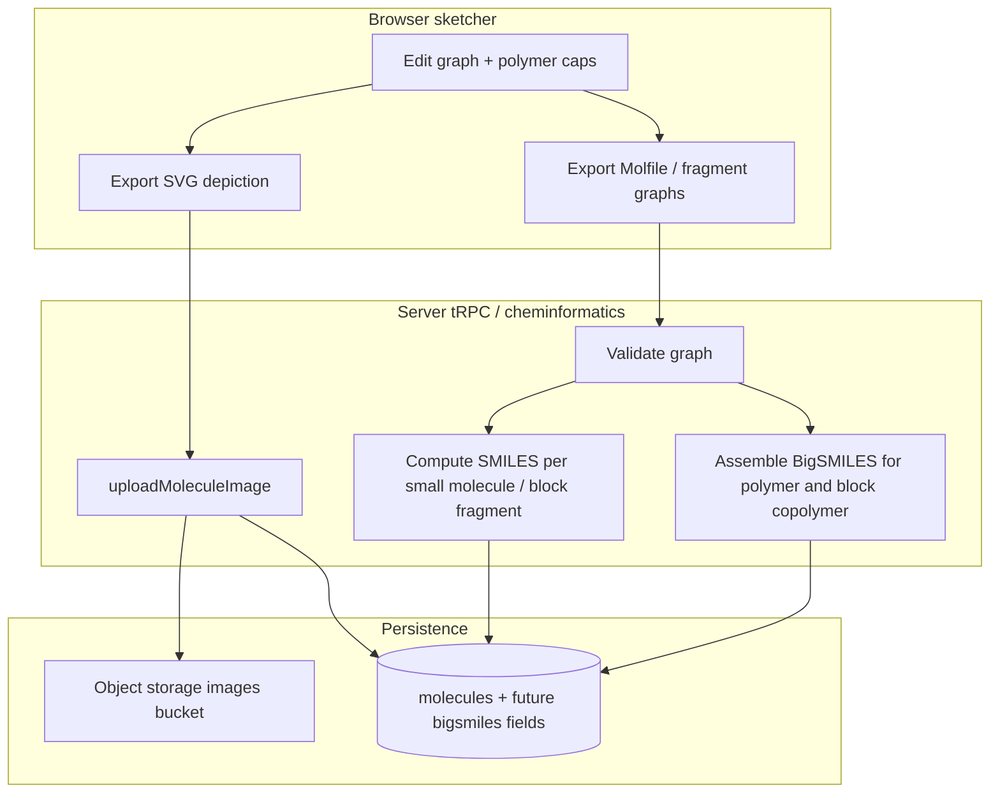

# Molecule sketcher and structure pipeline

This document is the implementation plan for replacing (or supplementing) hand-uploaded structure images with an in-app drawing and validation pipeline. The sketcher is the **single authoring surface** for both **visual output** (cached depiction) and **machine-readable notations** (SMILES and BigSMILES), so contributors are not required to use external drawing tools for routine structures.

**Branch:** `feature/molecule-sketcher-pipeline`  
**Related product surfaces:** molecule contribute (`/contribute/molecule`), NEXAFS “add molecule” modal, `MoleculeImageSVG` / `molecule-display` rendering.

**Storage note:** Canonical structure images are stored in **object storage** via the existing `**images` bucket** and `molecules.imageurl` field (Supabase Storage in this codebase—the same pattern as today’s SVG upload, not a separate S3 product unless infrastructure changes).

---

## 1. Core functionalities

The sketcher must deliver **four** integrated capabilities. Everything else in this document supports or constrains these.

| #     | Capability                                      | Outcome                                                                                                                                                                                                                                                                                                      |
| ----- | ----------------------------------------------- | ------------------------------------------------------------------------------------------------------------------------------------------------------------------------------------------------------------------------------------------------------------------------------------------------------------ |
| **1** | **Structure image export and upload**           | Produce an **SVG** (preferred) depiction and save it through the same path as manual uploads: **upload once**, store public URL on the molecule record, reuse for all views without recomputing layout on each page load.                                                                                    |
| **2** | **Polymer repeat-unit notation (caps)**         | Support **repeat-unit drawings** with **caps**: dangling bonds through brackets, square-bracket repeat framing, and subscript **n** (and related polymer drawing conventions) so materials scientists see **intended connectivity**, not an arbitrary oligomer.                                              |
| **3** | **SMILES for small molecules and block pieces** | **Derive canonical SMILES** for (a) ordinary small molecules and (b) **each chemically well-defined fragment** that represents a **block** or **repeat piece** in a **block copolymer**, so identifiers and search can use standard cheminformatics where SMILES is appropriate.                             |
| **4** | **BigSMILES for polymers and block copolymers** | **Assemble and validate BigSMILES** for **homopolymers**, **statistical copolymers**, and **block copolymers** from the graph the user drew (repeat units, bond descriptors, stochastic syntax as required by the BigSMILES spec), so polymer identity is not forced into a single inadequate SMILES string. |

**Dependencies between items:** (1) is always the **cached depiction** committed to storage. (2) is **visual semantics** on top of the same editor canvas. (3) and (4) are **parallel outputs** from the validated graph: SMILES where the chemistry is a discrete molecule or a defined fragment; BigSMILES where the chemistry is macromolecular or explicitly polymeric.

---

## 2. Secondary goals

1. **Lower the barrier to contribution** so users are not required to produce ChemDraw-quality SVG/PNG offline before submitting.
2. **Preserve current UX contracts** for **SVG:** public URL on `molecules.imageurl`, theme-aware recoloring via `MoleculeImageSVG`. **Raster** is out of scope for structures (§14.2).
3. **Ground truth remains connectivity + identifiers:** align **SMILES**, **BigSMILES**, **InChI**, **chemical formula**, **CAS**, **PubChem CID** where applicable; surface mismatches instead of silent divergence.
4. **Isolate experimentation:** **Sandbox** route (`/sandbox`) for **maintainers and administrators** (see §8, §15) to prototype drawing without blocking production contribute flows.
5. **Plan for hard cases:** salts, coordination complexes, ionic assemblies, ambiguous disconnections in source databases, and consistent 2D layout.

## 3. Non-goals (initial phases)

- Full **quantum chemistry** or 3D conformer pipelines in the browser.
- Replacing **InChI** as the primary exchange identifier for small molecules without a deliberate migration project.
- **Fully automatic** BigSMILES (core 4) for **arbitrary** sketches without **user-confirmed** repeat-unit boundaries and bond descriptors—ambiguous graphs must not be written silently.
- Shipping **core 4** before **core 2** is usable: polymer **notation in the image** should agree with the BigSMILES story.
- **Raster structure depictions** as a supported long-term format (see §14.2).

## 4. Current state (repository facts)

### 4.1 Database (`prisma/schema.prisma`)

- `molecules` holds: `iupacname`, `inchi`, `smiles`, `chemicalformula`, `casnumber`, `pubchemcid`, `imageurl` (nullable), metadata counts, `createdby`.
- There is **no** column today for: Molfile, Ketcher JSON, editor graph, BigSMILES, polymer repeat metadata, or structure version/hash.

### 4.2 Contribute flow

- **Create:** `molecules.create` via `moleculeUploadSchema` (`src/types/upload.ts`); image is **not** part of create.
- **Image:** `molecules.uploadImage` accepts base64 data URLs; `uploadMoleculeImage` writes to Supabase and sets `imageurl`.
- **UI:** `MoleculeContributionForm` — optional file after record exists; DB search can prefill `imagePreview` from existing `imageUrl` without re-uploading a file on submit.

### 4.3 Storage (`src/server/storage.ts`)

- Bucket `images`, file `{moleculeId}.{ext}`, `upsert: true`.
- Allowed MIME types today include **raster** types and `**image/svg+xml`**; `**MoleculeImageSVG` rejects non-SVG** for theme recoloring. **Planned:** restrict molecule depiction uploads to **SVG only** and remove raster from the contribute path (§14.2).

### 4.4 Display

- `MoleculeImageSVG` fetches SVG, applies CPK-oriented colors for light/dark mode.

**Implication:** any new pipeline should **finalize** to an SVG (or accepted format) **uploaded once** and referenced by `imageurl`, unless the product explicitly adds a second “live render” path.

---

## 5. Design principles

| Principle                               | Rationale                                                                                                                                             |
| --------------------------------------- | ----------------------------------------------------------------------------------------------------------------------------------------------------- |
| **Cached depiction (core 1)**           | The **SVG in object storage** is the browse/detail artifact; do not re-layout on every request.                                                       |
| **Polymer honesty (core 2)**            | Caps and brackets are **first-class drawing state**, not a post-process sticker on a SMILES depiction.                                                |
| **Dual serialization (core 3–4)**       | **SMILES** for fragments and small molecules; **BigSMILES** for macromolecular connectivity; never conflate the two without an explicit product rule. |
| **Editor source optional but valuable** | Storing Molfile/Ketcher JSON (or equivalent) enables re-edit and audit without inferring the graph from strings alone.                                |
| **Separation of concerns**              | UI sketcher → validated graph → **parallel exports** (SVG + SMILES/BigSMILES) → persistence.                                                          |
| **Progressive disclosure**              | Ship small-molecule SMILES + SVG first; add repeat-unit tools, caps, and BigSMILES assembly in later slices.                                          |

---

## 6. Architecture overview

**Candidate stacks (evaluate in spike):**

- **Ketcher + Indigo (`indigo-ketcher`):** mature web editor, Molfile/SMILES, 2D clean; assess **polymer brackets and SRU** support versus custom SVG layer for caps.
- **RDKit.js (`@rdkit/rdkit`):** strong for **depiction** and **SMILES** from mol blocks when WASM size is acceptable; **BigSMILES** likely needs **dedicated BigSMILES libraries** or server-side tooling, not RDKit alone.
- **Hybrid (expected):** Editor for graph + SVG; **RDKit/Indigo** for fragment SMILES; **BigSMILES reference implementation** (or spec-driven assembler) for macromolecular strings; custom UI for **repeat-unit caps** if the editor does not render them natively.

---

## 7. Feature module layout (`src/features`)

Proposed package (name TBD, e.g. `molecule-structure` or `molecule-sketcher`):

| Area          | Responsibility                                                                                                        |
| ------------- | --------------------------------------------------------------------------------------------------------------------- |
| `components/` | Editor shell, toolbar, **repeat-unit / cap** tools, export/save bar, validation messages (HeroUI).                    |
| `hooks/`      | Editor state, undo, dirty flags, **mode** (small molecule vs polymer vs block copolymer), tRPC integration.           |
| `utils/`      | SVG serialization, data URL helpers, **fragment decomposition** for block copolymers (feeds server SMILES per block). |
| `types.ts`    | Editor snapshot, **repeat-unit bracket** model, block boundaries, BigSMILES-related metadata.                         |
| `index.ts`    | Barrel exports for contribute page and lab route only.                                                                |

**Do not** embed heavy editor logic in `src/app` route files beyond composition.

---

## 8. Sandbox route (`/sandbox`)

**Purpose:** load a **real molecule** from the DB (by id or search), show **current stored SVG** via `MoleculeImageSVG`, and mount the **prototype editor** seeded from SMILES/Molfile import when available. The molecule structure lab lives at `**/sandbox/molecule-structure`** (linked from the Sandbox tools index at `/sandbox`); the legacy `/labs` URL redirects to `/sandbox`.

**Access control (resolved):** **Administrators** and **maintainers** only—not all authenticated users. Both roles see a **Sandbox** entry in the **user profile dropdown** (same surface as Profile, Dashboard, Log out). See **§15** for the prerequisite **Stage 0** work (roles + route guard + menu item).

**Requirements:**

- **Auth:** session must include `**maintainer` or `administrator`** (exact enum values TBD in Prisma).
- **No accidental writes:** default **dry-run** export; optional “upload to test molecule id” behind explicit confirmation.
- **Reuse:** `trpc.molecules.getById` (or search) for `imageUrl`, SMILES, InChI, formula.

**Out of scope for v0 lab:** persisting new schema fields beyond what Phase 2+ defines; lab may call existing `uploadImage` against a test molecule when appropriate.

---

## 9. Data model — recommended direction (robust and extensible)

**Problem:** Adding many parallel columns (`smiles_block_a`…`d`, ad hoc peptide fields later) scatters logic and complicates every query.

**Direction:** Keep `**molecules`** as the **anchor row** for browse, favorites, and NEXAFS joins, but make classification and macromolecular detail **normalized and typed** so new **kinds** (peptides, oligos, future classes) can add **kind-specific rows** without repeated wide-column migrations.

### 9.1 Molecule kind and line notations (single row, still on `molecules`)

| Field (conceptual)              | Purpose                                                                                                                                                                                                                                               |
| ------------------------------- | ----------------------------------------------------------------------------------------------------------------------------------------------------------------------------------------------------------------------------------------------------- |
| `**molecule_kind`** (enum)      | Values such as `**small_molecule`**, `**homopolymer`**, `**block_copolymer**`, `**statistical_copolymer**` (or statistical as a flag under block copolymer—see §14.3). Drives which forms are required in the upload portal and how formulas display. |
| `**canonical_smiles**`          | **Chosen** line notation for small-molecule connectivity (see §14.1): either PubChem-derived or drawer-computed; **canonical** form from the toolchain when applicable.                                                                               |
| `**bigsmiles`** (nullable)      | **Core 4** string for polymers and block copolymers; null for pure small molecules without macromolecular description.                                                                                                                                |
| `**inchi`**                     | Retained where meaningful; polymers may have partial or absent InChI—product rules should not hard-fail on empty InChI for polymer kinds if industry practice supports it.                                                                            |
| `**chemical_formula`**          | Support **display-oriented** strings for polymers: e.g. `(C8H8)n`, `(C2H4)n(C3H4O2)m`, and more complex Hill-ordered repeat patterns as required. Validation differs by `molecule_kind`.                                                              |
| `**pubchem_cid` / `casnumber`** | Unchanged; **reference** identifiers, not the sole source of truth for SMILES after user override.                                                                                                                                                    |

**Migration note:** Today’s `smiles` column can be **renamed or migrated** to `canonical_smiles` in a dedicated migration, or kept as an alias during transition; pick one name in code and deprecate the other.

### 9.2 Block copolymer detail (normalized, avoids four nullable columns)

Prefer a child table, e.g. `**molecule_blocks`**, with:

- `molecule_id` (FK), `block_index` (0–3 for **up to four blocks**), `**label`** (`A`, `B`, …), `**fragment_smiles`** (canonical SMILES for that repeat or block fragment), optional `**repeat_formula`** or link to repeat unit id.
- **Statistical copolymers:** either a row flag or a sibling table `**molecule_copolymer_stochastic`** holding the **statistical description string** (e.g. notation along the lines of `A-b-(B r C)`—exact syntax is a product/parser contract) and linkage to the parent block-copolymer molecule.

This keeps **block copolymers first-class** without encoding four blocks in flat columns on `molecules`.

### 9.3 Future kinds (peptides, biopolymers)

Add `**molecule_kind`** values and **optional** one-to-one extension tables (e.g. `molecule_peptide`) keyed by `molecule_id` only when that kind is implemented—**avoid** nullable peptide columns on `molecules` itself.

### 9.4 Depiction and editor source

| Concept                                          | Purpose                                  |
| ------------------------------------------------ | ---------------------------------------- |
| `imageurl`                                       | Cached **SVG** only; **core 1**.         |
| `structure_molfile` or `ketcher_json` (optional) | Round-trip editing; audit trail.         |
| `structure_format_version`                       | Migration safety.                        |
| `depiction_content_hash` (optional)              | Invalidate cache when depiction changes. |

**Rule:** `imageurl` remains the **fast path** for read-heavy UI; normalized blocks and BigSMILES support **search, science, and export** without duplicating four SMILES columns on the parent row.

---

## 10. Phased implementation

Phases map to the **core functionalities** in §1: **(1)** cached SVG, **(2)** polymer caps, **(3)** SMILES for small molecules and block fragments, **(4)** BigSMILES for polymers and block copolymers.

### Phase 0 — Spike (parallelizable)

**Covers core 1 and the start of core 3.** Also includes **prerequisite work on a separate Git branch** for **user roles and Labs access**—see **§15** (implement and merge before or in parallel with the sketcher spike, as the team prefers).

- **§15 — Roles branch:** `administrator` / `maintainer` on `user`, seed **core maintainers** as administrators, remaining users as maintainers, route guard + **Sandbox** link in profile dropdown for both roles; administrators can promote users to maintainer (details in §15).
- Bundle size and load: Ketcher React vs iframe vs lazy RDKit WASM. **Phase 0 lab ships** `react-ocl` (`MolfileSvgEditor`) + **OpenChemLib** in the sandbox molecule lab; Ketcher remains a candidate for later if polymer tooling or UX requires it.
- **Core 1:** Export **SVG string** (`Molecule.toSVG` dry run in lab) → future `uploadMoleculeImage` (`image/svg+xml`) → `molecules.imageurl`; confirm `MoleculeImageSVG` accepts exported structure (paths, text).
- **Core 3 (partial):** Server parses molfile with **OpenChemLib** (`moleculeStructure.canonicalizeMolfile` → isomeric SMILES + idcode); RDKit/Indigo optional for cross-checks later. Define validation errors for the client.
- Document gaps where SMILES is **not** sufficient (salts, metals) for later multi-field handling.

### Phase 1 — Sandbox molecule lab

- Implemented at `**/sandbox/molecule-structure`** with the shared sandbox layout guard.
- Side-by-side: DB `MoleculeImageSVG` + **OpenChemLib** editor on `/sandbox/molecule-structure` (Phase 0 lab).
- Molecule picker (search by name or paste UUID); optional dry-run export of **SVG + SMILES** for comparison.

### Phase 2 — Contribute integration

**Covers core 1 + core 3 for small molecules.**

- “Draw structure” entry on `MoleculeContributionForm` (modal or inline).
- After `create`/`update`: upload **SVG** via `uploadImage`; persist `**canonical_smiles`** (see §9, §14.1).
- **SMILES reconciliation (§14.1):** user **must** commit to either **PubChem-imported** SMILES or **drawer-computed** canonical SMILES. If the drawn graph **differs** from the tabulated SMILES string, show an explicit **warning** that the graphs disagree—**allowed** because: (i) SMILES is not unique; (ii) tabulated SMILES are often wrong for **ligand bonds** or **ionic/multi-component** representations; (iii) external databases can be wrong. No silent overwrite.
- **Raster:** disallow **PNG/JPEG** uploads for structure depictions going forward; **SVG only** for `imageurl` (align `storage.ts` allowlist and UI with §14.2). Plan removal of generic **file upload** once sketcher-generated SVG is default.

### Phase 3 — Polymer visuals and caps

**Covers core 2.**

- Editor (or overlay) support for **repeat unit framing**: brackets, **n**, **dangling bonds** through brackets for backbone connectivity to neighboring units.
- Ensure exported **SVG** includes caps consistently (core 1 still applies).
- Optional: persist **polymer layout metadata** JSON if the editor cannot round-trip caps through Molfile alone.

### Phase 4 — Block copolymer SMILES fragments

**Extends core 3.** Align with **§14.3** and `**molecule_blocks`** (§9.2).

- Treat **block copolymers as first-class entities** with **up to four blocks** (`block_index` 0–3).
- **UI labels** `A`, `B`, … for blocks; **statistical copolymers** live under the block-copolymer flow with a user-provided **statistical description string** (examples along the lines of `A-b-(B r C)`—exact grammar TBD with BigSMILES stochastic semantics).
- For each block, persist **fragment SMILES** in `**molecule_blocks`** and compute **canonical** forms server-side.
- **Upload portal:** implement block + statistical fields in the same contribute experience as `molecule_kind`.

### Phase 5 — BigSMILES assembly

**Covers core 4.**

- Integrate or implement **BigSMILES** generation from the **same graph** used for SVG (bond descriptors, stochastic sections as required); validate against [BigSMILES data format](https://olsenlabmit.github.io/BigSMILES/docs/DataFormat.html) and reference tooling ([olsenlabmit/bigSMILES](https://github.com/olsenlabmit/bigSMILES)).
- **Homopolymers, statistical copolymers, block copolymers:** map product modes to BigSMILES constructs; user confirmation before persisting ambiguous stochastic graphs.
- Prisma: add `**bigsmiles`** (and any `polymer_metadata` JSON) alongside `imageurl`; **cached SVG** remains the read path for images.

### Phase 6 — Persistence of editable source (optional but recommended)

- Prisma migration for Molfile/Ketcher JSON (or native graph snapshot).
- tRPC: extend `create`/`update` or add `saveStructureSource` procedure.
- Backfill: **none** required for legacy rows.

---

## 11. Risks and mitigations

| Risk                                              | Mitigation                                                                                                       |
| ------------------------------------------------- | ---------------------------------------------------------------------------------------------------------------- |
| **SMILES** omits counterions / solvents           | Store **multi-component** representation or explicit salt fields; show warnings in UI.                           |
| **Polymers** not representable in a single SMILES | Use **BigSMILES (core 4)** for macromolecule; use **per-block SMILES (core 3)** only for well-defined fragments. |
| **Block copolymer** graph partitioning wrong      | User-defined **block boundaries** in UI; validate fragments before persisting SMILES per block.                  |
| **Caps in SVG** diverge from BigSMILES            | Treat **one graph model** as source; drive both SVG export and string assembly from it.                          |
| **Metal complexes / dative bonds**                | RDKit limitations; prefer Molfile/V3000 from editor; document known failures.                                    |
| **2D layout ugliness**                            | Editor “clean” + store coordinates; optional manual nudge in future.                                             |
| **Bundle size**                                   | Lazy load editor on contribute + lab only; code-split WASM.                                                      |

---

## 12. Testing strategy

- **Unit:** export helpers, MIME detection, size limits (align with `MAX_FILE_SIZE` in storage); **BigSMILES** parser round-trip on fixture strings (when library available).
- **Integration:** tRPC `uploadImage` with SVG fixture; Prisma readback of `imageurl`; persisted **SMILES** / **BigSMILES** fields match server computation from a fixed mol input.
- **Polymer / block:** golden tests for **fragment SMILES** per block and assembled **BigSMILES** for at least one homopolymer and one two-block example.
- **E2E (optional):** lab page exports non-empty SVG; optional assertion on SMILES for benzene-scale structures.
- **Visual:** manual check that **caps and brackets** appear in SVG and match product expectations for `MoleculeImageSVG`.

---

## 13. Documentation and handoff

- This file lives in `docs/` as the **single planning source** until the feature ships; update phases when scope changes.
- Link from `AGENTS.md` or `CONTRIBUTING.md` **only if** the team wants discoverability (optional follow-up).

---

## 14. Resolved product decisions

These supersede the former “open questions” list.

### 14.1 SMILES: PubChem vs drawer (canonical)

- The user **must choose** one authoritative source for the stored **canonical SMILES**: either the **PubChem-imported** value or the **computed** value from the sketcher (after server canonicalization).
- If the **drawn molecular graph** is **not equivalent** to the tabulated SMILES string, show a **clear warning** that the structure **differs** from the imported SMILES. Proceeding is **OK** when the user explicitly selects the drawer output, because:
  1. **SMILES is not unique**—multiple strings can represent the same graph.
  2. Tabulated SMILES are often **incorrect or incomplete** for **ligand bonds**, **coordination complexes**, and **ionic/multi-component** systems.
  3. External tables can simply be **wrong**.

### 14.2 Depiction format and uploads

- **Raster is never allowed** for structure depictions in product UI. **Only SVG** is stored and rendered in theme-aware flows (`MoleculeImageSVG`).
- **Long-term:** remove the **generic image upload** path entirely; structures come **only** from the sketcher (or future SVG-only import) with **computed** SVG stored in object storage.

### 14.3 Block copolymers and statistical copolymers

- **Block copolymers** are **first-class** entities (not an afterthought on a small-molecule row).
- Support **up to four blocks** per macromolecule.
- **Statistical copolymers** are modeled **under** the block-copolymer concept; the user must specify the **statistical nature** explicitly.
- **UI:** blocks are labeled **A** and **B** (and extensions for C/D as needed) so users and BigSMILES assembly share the same vocabulary.
- **Statistical string:** the user supplies a notation describing the stochastic construction (examples along the lines of `**A-b-(B r C)`** or similar patterns defined by the parser and BigSMILES rules). Implement this in the **upload portal** alongside block and `molecule_kind` selection.

### 14.4 Storage shape (summary)

- Prefer `**canonical_smiles`** + `**bigsmiles`** (nullable) + `**molecule_kind`** over overloading a single `smiles` column for all chemistry.
- Use `**molecule_blocks`** (and optional stochastic metadata) rather than four parallel SMILES columns on `molecules`—see **§9**.
- **Polymer formulas** in display and storage can use **repeat notation** (e.g. `(C8H8)n`, `(C2H4)n(C3H4O2)m`); validation rules depend on `molecule_kind`.

### 14.5 Extensibility (peptides and future types)

- Avoid splintering the codebase with **one-off tables per type** where possible; prefer `**molecule_kind`** plus **normalized** child tables keyed by `molecule_id` for kind-specific data (blocks now, peptides later).
- The `**molecules`** row remains the stable join point for browse, NEXAFS, and favorites.

---

## 15. Stage 0 — User roles, seed data, and Sandbox access (separate branch)

**Intent:** Ship **authorization** and **navigation** for **Sandbox** **before** or **alongside** the sketcher spike, on a **dedicated Git branch** (e.g. `feature/user-roles-and-labs-access`) so reviews stay focused.

### 15.1 Schema (`next_auth.user` today)

- Extend the existing `**role`** field (currently `String` default `"contributor"`) to a constrained set, e.g. `**contributor` | `maintainer` | `administrator`**, or add an enum / check constraint in migration.
- **Administrators** can **assign** or **revoke** **maintainer** (exact UX: admin UI vs migration-only—TBD; **product decision:** administrators add maintainers).

### 15.2 Seed / initial assignment (bootstrap)

- **Administrators (core maintainers):** **Harlan Heilman**, **Brian Collins**, **Obaid** (match users by **email** or **ORCID** once accounts exist—implementation details in migration/seed script).
- **Maintainers:** **all other existing users** at cutover time, unless individually excluded (policy TBD).

### 15.3 Sandbox route and profile menu

- Add a `**Sandbox`** link to the **user profile dropdown** (same component as Profile, Log out, etc.) for users with the **Labs** permission (`labs_access` / `canAccessLabs`) or **user administration** (`canManageUsers`), matching the runtime guard on `/sandbox`.
- **Route guard:** deny users without those capabilities (and unauthenticated users) with **redirect** off `/sandbox` in production; development may allow all signed-in users for local iteration.
- **Administrators** retain full access to Sandbox; **no** separate “admin-only” Sandbox unless product later requires it.

### 15.4 Auth in tRPC / middleware

- Add a small helper (e.g. `requireMaintainerOrAdmin`) used by Sandbox-related procedures and server components for the Sandbox layout when stricter checks are needed beyond the session flags above.

---

## 16. References (external)

- BigSMILES: [BigSMILES project documentation](https://olsenlabmit.github.io/BigSMILES/docs/DataFormat.html), [olsenlabmit/bigSMILES](https://github.com/olsenlabmit/bigSMILES) on GitHub.
- Ketcher: [epam/ketcher](https://github.com/epam/ketcher).
- RDKit: [RDKit documentation](https://www.rdkit.org/docs/index.html), RDKit Book for SMILES and dative bonds.
- OpenSMILES: [opensmiles.org](http://opensmiles.org/opensmiles.html).

---

## 17. Checklist before merge to `main`

- **Sandbox** route restricted per **§15**; profile link visible only when the session grants Labs or user-admin capability (§15).
- No regression to `molecules.create` / `uploadImage` contracts **unless** intentionally removing raster per §14.2 (document in PR).
- **Core 1:** **SVG-only** for structure depictions; browse/detail use **cached** `imageurl`.
- **Core 2:** polymer **caps/brackets** documented and visually verified for at least one reference repeat unit.
- **Core 3:** **canonical_smiles** choice flow **PubChem vs drawer** with mismatch **warning** when applicable (§14.1).
- **Core 4:** BigSMILES persisted only when generation is validated; ambiguous polymer graphs not saved without confirmation.
- Block copolymer **portal** fields and `**molecule_blocks`** (or equivalent) aligned with §9 and §14.3.
- `bun run` lint/typecheck/test per repo CI.
- `AI Role` section in PR per project policy.

